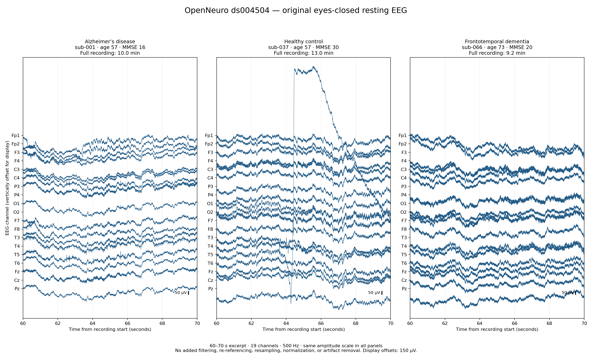

# Raw Data Analysis

To visualize what data are dealing with, we generated a plot to visualize what
kind of data is present in the three different classes.

See the plot below:

We can see that the data is mainly the fluctuations of different channels over time. Different subjects have different recording lengths, different ages, and MMSE scores.

We can see an example of an artifact for the healthy control with a big spike at channel T5.
